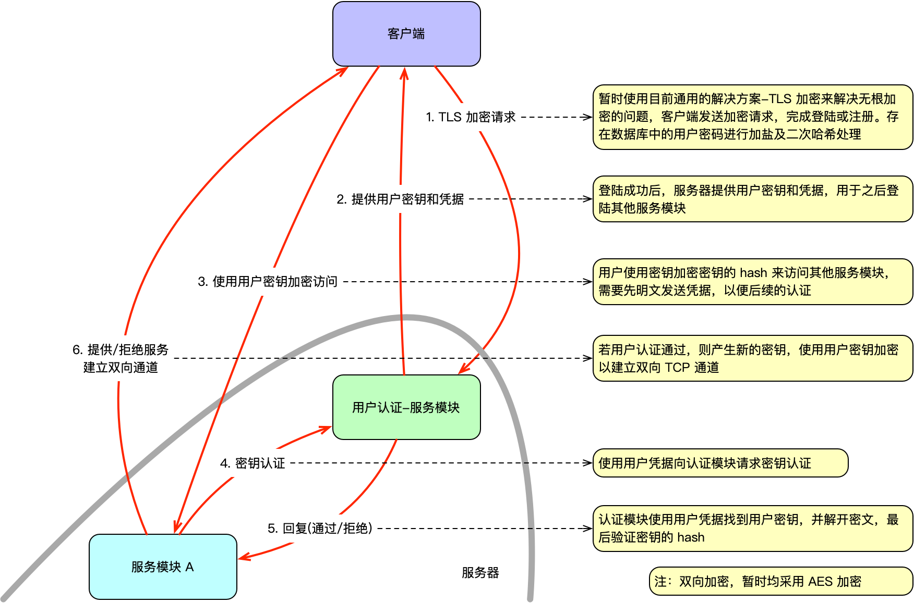

# Whooshing 用户认证模块
Whooshing 项目的用户认证模块，处理对外加密，密钥交换，以及用户注册，登陆的功能，并为其他服务模块提供加密访问连接和密钥。

另见主项目 [whooshing](https://github.com/SJJC-Team/whooshing)

## **部署说明**

- **开发工具**：
  - **API 服务**：Node.js 23.5.0
  - **数据库**：PostgreSQL 17.2
  - **后端开发**：Vapor(Swift)

## **设计图**

见[所有设计图](diagrams)

## **代码提交约定**

见 [代码提交约定](https://github.com/SJJC-Team/.github-private/blob/main/profile/README.md)

## **许可证**

本项目采用 [Mozilla Public License Version 2.0](LICENSE) 开源。

## **联系方式**

* 开发者邮箱：contact@official.whooshings.space

* 项目主页：https://whooshings.space